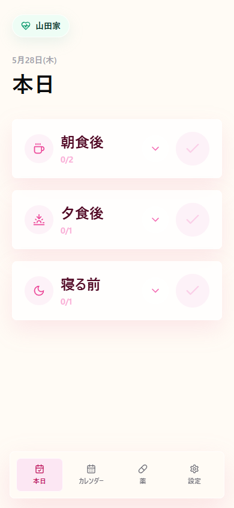
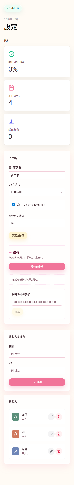
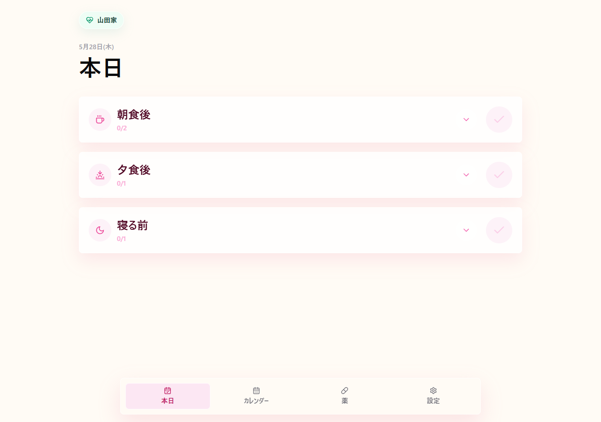

# Medicinator

Medicinator は、家族で薬の服用予定と服用済み記録を共有する Web アプリです。スマホのホーム画面に追加して、毎日の服薬チェックをすぐ開ける体験を想定しています。

## For Users

### できること

- 今日飲む薬をタイミングごとに確認する
- チェックボタンで服用済みにする
- カレンダーで日付ごとの服薬状況を見る
- 薬の名前、用量、服用方法、服用期間、飲むタイミングを登録する
- 飲む人を登録、編集、削除する
- Family 招待コードで家族と共有する
- スマホのホーム画面に追加してアプリのように開く

### 使い方

1. ログインする
2. Family を作成する、または招待コードで参加する
3. 設定で飲む人を登録する
4. 薬タブで薬と飲むタイミングを登録する
5. 本日タブで服用済みをチェックする
6. カレンダーで過去や予定日の服薬状況を確認する

### 画面

| 本日の服薬 | 設定と招待 |
| --- | --- |
|  |  |



## For Developers

### 技術スタック

- Backend: ASP.NET Core 10, MVC + Service, EF Core, SQLite
- Frontend: React 19.2, TypeScript, Vite, Tailwind CSS
- Auth: Firebase Authentication
- Deploy: Cloudflare Pages, Docker Compose, GCP Always Free VM 想定

### リポジトリ構成

- `backend/Medicinator.Api`: ASP.NET Core API
- `backend/Medicinator.Api.Tests`: バックエンドテスト
- `frontend/medicinator-web`: フロントエンドアプリ
- `deploy`: Docker Compose とホスティング設定資料
- `docs/images`: README 用スクリーンショット
- `.agents`: 実装、コメント、アーキテクチャ規約

### ローカル起動

バックエンド:

```powershell
dotnet restore
dotnet test Medicinator.slnx
dotnet run --project backend\Medicinator.Api\Medicinator.Api.csproj
```

フロントエンド:

```powershell
cd frontend\medicinator-web
corepack pnpm install
$env:VITE_API_BASE_URL="http://localhost:5020"
corepack pnpm dev
```

フロントエンドだけを確認する場合、API に接続できなくても初期データで画面表示できます。

### PWA

スマホの「ホーム画面に追加」向けに以下を用意しています。

- `frontend/medicinator-web/public/manifest.webmanifest`
- `frontend/medicinator-web/public/apple-touch-icon.png`
- `frontend/medicinator-web/public/icons/icon-192.png`
- `frontend/medicinator-web/public/icons/icon-512.png`
- `frontend/medicinator-web/public/favicon.svg`

Service Worker はまだ入れていません。服薬記録の同期事故を避けるため、初期実装ではオンライン前提の PWA としています。

### デプロイ

デプロイ資料は [deploy/README.md](deploy/README.md) にあります。

初期のホスティング方針:

- フロントエンドは Cloudflare Pages
- バックエンド API は Docker Compose で起動
- バックエンドホストは GCP Always Free 対象の `e2-micro` VM を想定
- SQLite DB は Docker named volume に永続化
- パブリックルーティングは Cloudflare DNS/Proxy を使用
- 認証は Firebase Auth を使用

### 開発規約

編集前に [AGENTS.md](AGENTS.md) を確認してください。実装、コメント、アーキテクチャの規約は `.agents` 配下にあります。

EF Core CLI はリポジトリローカルツールとして固定しています。

```powershell
dotnet tool restore
dotnet ef --version
```
